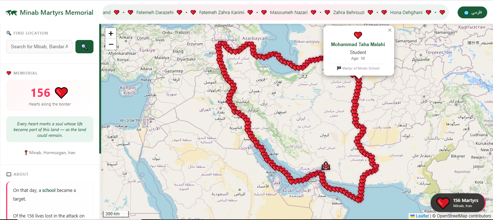

# ❤️ Minab Memorial Map

> **A WebGIS memorial for 156 lives lost at Minab School**

On that day, a school became a target.
Of the 156 lives lost, 120 were children — students who had come to learn, not to become part of history. The rest were teachers and staff who stood beside them until the end.

Their hearts now line the border of the land they loved — and gave everything to protect.

---

## 🌐 Live Demo

🔗 **[View the Memorial Map](https://KeyhanGIS.github.io/Minab-Memorial-Map/)**

---

## 📸 Preview

  

---

## ✨ Features

| Feature | Description |
|---------|-------------|
| ❤️ **156 Hearts** | Each heart placed along the border represents one life |
| 🗺️ **Animated Border** | The country's border glows as a symbol of remembrance |
| 🖱️ **Click to Remember** | Click any heart to see the name of the person it represents |
| 🔍 **Location Search** | Search for any location on the map |
| 🌐 **Bilingual** | Full support for Persian (فارسی) and English |
| 📱 **Responsive** | Works on desktop, tablet, and mobile |

---

## 💡 Why WebGIS?

This project is also a statement about what maps can do.

WebGIS is not only for urban planning, logistics, or navigation.
It can carry memory. It can carry grief. It can make invisible lives — visible.

If you are a developer, feel free to fork this project and adapt it for other memorials or humanitarian causes.

---

## 🛠️ Technologies

| Technology | Purpose |
|------------|---------|
| [Leaflet.js](https://leafletjs.com/) | Interactive mapping |
| [OpenStreetMap](https://www.openstreetmap.org/) | Base map tiles |
| [Photon API](https://photon.komoot.io/) | Location search |
| HTML5 / CSS3 / Vanilla JS | No frameworks — lightweight and fast |
| GeoJSON / JSON | Data storage |

---

## 📁 Project Structure

    minab-memorial-map/
    │
    ├── index.html
    ├── css/
    │   └── style.css
    ├── js/
    │   └── script.js
    ├── data/
    │   ├── martyrs.json
    │   └── border-points.geojson
    └── assets/
        └── preview.png

---

## 📊 Data Structure

**data/martyrs.json**

    {
      "total": 156,
      "martyrs": [
        {
          "id": 1,
          "name_fa": "نام شهید",
          "name_en": "Martyr Name",
          "age": 12,
          "job_fa": "دانش‌آموز",
          "job_en": "Student"
        }
      ]
    }

**data/border.geojson**

    {
      "type": "FeatureCollection",
      "features": [...]
    }

---

## 🚀 Run Locally

**Option 1 — Python:**

    git clone https://github.com/KeyhanGIS/Minab-Memorial-Map.git
    cd minab-memorial-map
    python -m http.server 8000

Then open `http://localhost:8000` in your browser.

**Option 2 — VS Code Live Server:**

1. Install the "Live Server" extension
2. Right-click on `index.html`
3. Select "Open with Live Server"

> ⚠️ Do not open `index.html` directly — use an HTTP server so JSON files load correctly.

---

## 🤝 Contributing

This project is open to contributions. You can:

- Improve the UI or animations
- Add more languages
- Adapt the structure for another memorial
- Fix bugs or improve performance

Steps:

    git checkout -b feature/your-idea
    git commit -m 'Add your idea'
    git push origin feature/your-idea

Then open a Pull Request.

---

## 📜 License

MIT License — free to use, modify, and distribute.

---

## 🙏 In Memory

> *They are not statistics — they had names.*

🕯️ This map is dedicated to the 156 souls of Minab School.
May their memory never fade.

---

  Built with ❤️ using WebGIS | Open Source | Contributions Welcome

